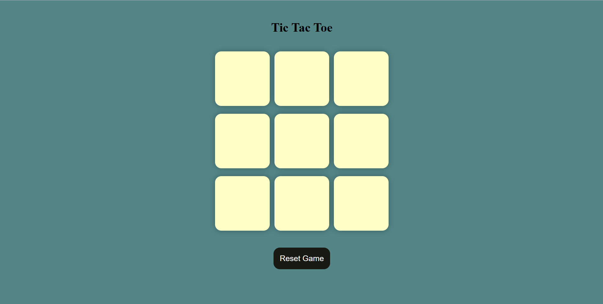

# 🎮 Tic-Tac-Toe Game

> A responsive browser-based Tic-Tac-Toe game built using HTML, CSS, and JavaScript with winner detection, draw handling, and game reset functionality.

Tic-Tac-Toe is a classic two-player strategy game where players take turns marking X and O on a 3×3 grid. The application automatically detects winning combinations, handles draw scenarios, and provides options to restart or begin a new game through a clean and interactive user interface.

## 🚀 Live Demo

🌐 Live Website: https://tic-tac-toe-game-two-sepia.vercel.app

## 🔗 GitHub Repository

💻 GitHub: https://github.com/ayushraj78088/tic-tac-toe-game

## 📸 Screenshots

### Game Interface



## ✨ Features

* 🎯 Two-player gameplay
* ❌ Player X and ⭕ Player O turns
* 🏆 Automatic winner detection
* 🤝 Draw game detection
* 🔄 Reset current game
* 🆕 Start a new game instantly
* 📱 Responsive design
* ⚡ Fast and lightweight implementation

## 🛠️ Tech Stack

### Frontend

* HTML5
* CSS3
* JavaScript (ES6)

### Concepts Used

* DOM Manipulation
* Event Handling
* Arrays and Loops
* Game Logic
* Conditional Rendering

## 📂 Project Structure

```bash
project/
│
├── index.html
├── style.css
├── script.js
└── screenshots/
    └── tic-tac-toe.png
```

## 💻 Running the Project Locally

### 1. Clone the Repository

```bash
git clone https://github.com/ayushraj78088/tic-tac-toe-game
```

### 2. Navigate to the Project Folder

```bash
cd tic-tac-toe-game
```

### 3. Open the Application

Simply open:

```bash
index.html
```

in your preferred browser.

## 🎯 Learning Outcomes

This project helped reinforce:

* JavaScript fundamentals
* DOM manipulation techniques
* Event-driven programming
* Game state management
* Logical problem solving

---

⭐ If you enjoyed this project, consider giving it a star on GitHub!
